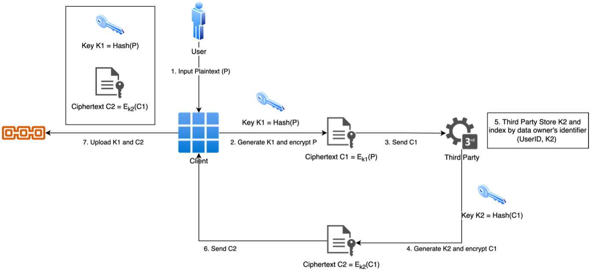
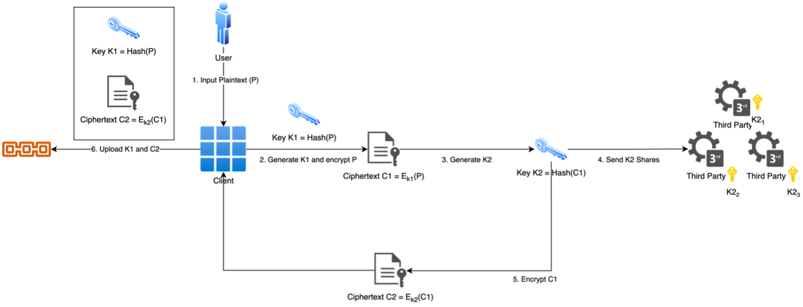

# Hybrid Blockchain Database Platform for Secure and Efficient Health Care Data Sharing
- Demo link: 
- :star2: **Found this repository helpful?** Light it up with a star :star2: and make my day! :wink:
---
- In this project, we proposed a privacy-preserving data sharing system using blockchain technology and encryption techniques. The system ensures data confidentiality, integrity, and availability while addressing data owner control and access management. Although the current system has limitations related to trust assumption, scalability, decentralization, and privacy, the proposed further developments, such as incorporating a hybrid cloud-blockchain system and implementing a secure multi-party computation protocol, address these concerns. By enhancing the system with these improvements, we can achieve a more robust, secure, and privacy-preserving solution for data sharing and management, harnessing the full potential of blockchain technology.

## 0. Setup
1. For user（How to use our system）
- 1.1 Prerequisite
  -   Before using our system, patients need to register a Cryptocurrency wallet themselves to facilitate subsequent registration and use.
- 1.2 Registration
  -   After completing the above steps, the patient can use our product. The first step is to register. Please fill in the patient's relevant information according to the requirements in our registration interface below. Please click next to proceed to the 1.3 part after ensuring that the information is correct. Once this step is completed, the patient will create a medical record book on our blockchain that belongs to them.
- 1.3 More information
  -   Whenever a user falls ill, they can enter their medical record book to update their condition. At this step, the user needs to fill in the relevant information as required and provide a detailed description of the condition based on the doctor's opinion. Please click next to proceed to the 1.4 part after ensuring that the information is correct. (All patient data is encrypted and stored on our blockchain, and access is strictly controlled and monitored.)
- 1.4 Payment
  -   After confirming the new condition, the system will automatically jump to the payment interface. Users need to make payments based on the gas fee calculated by the Ethereum system in order to update their new condition on the blockchain. Please note that different text means different data size, and will incur different costs. Please try to make the description concise while ensuring the completeness to save the cost.
- 1.5 Confirmation
  -   After the payment is completed, the interface will jump back to the original interface, and we can see that the new medical record has been updated to the system. By creating medical record books on our blockchain, patients can confidently know that their sensitive information is stored in a tamper proof and decentralized system that can resist unauthorized access. This intuitive interface allows patients to easily browse their medical records, track their medical progress, and make wise decisions about their health.
- 1.6 Authorization
  -   In order to ensure that data is not accessed or tampered with by unauthorized personnel, we have adopted strict data encryption. This means that if a new doctor needs to obtain the user's medical record or edit it for the patient, the user first needs to send a key request to the third-party institution. Then, when the authorized doctor requests, the third party will use the pre stored key to decrypt the encrypted content and send it back to the newly authorized doctor. Otherwise, the third party will reply with permission denied.

2. For hospital (How to configure the environment)
   - 2.1 prerequisite
     - First, the hospital need to install the software package npm for managing Ethereum development.
        ```shell
        npm install
        ```
     - Then, the Truffle framework needs to be installed to facilitate subsequent smart contract deployments.
        ```shell
        npm install -g truffle
        ```
- 2.2 Deploying the truffle framework
  -   Enter truffle deploy to enter the smart contract deployment phase
- 2.3 Assign the Address
  -   Configure the deployed contract addresses to our preset PatientData and SaveData smart contracts, respectively.
- 2.4 System startup
  -   Enter npm start to start our system.


---
## 1. Introduction
###   1.1 Background
- Over the past decades, we have seen the trend of increasingly digitized healthcare data with exponentially growing volume and value of data.  The management of healthcare related data is increasingly important to the healthcare organization, practitioners and ultimately to the welling being of the patients. More technologies have been deployed to protect sensitive healthcare data. For example, with a access list, only authorized individuals, like doctors or medication practitioners can access sensitive health information of a patient.

- According to market research analytic companies, global healthcare data management market is expected to grow at CAGR of 19.2% from 2023 to 2030 . This indicates a huge market demand for healthcare data management solutions.

- At the same time, data breaches are very common in the healthcare industry and pose a threat to the privacy and security of patient data. In 2020, there were 707 healthcare data breaches globally, compromising 51.9 million records. In 2019 and 2018, there were 115 and 663 data breaches respectively. This highlights the urgent need for better data management solutions that can protect patient data.

- Therefore, using blockchain technology in protecting privacy and security could be a solution. Indeed, companies are beginning to use blockchain technology to protect the privacy and security of patient data. According to a report by IDC, by 2021, 40% of healthcare organizations globally will use blockchain technology to improve issues such as data exchange, privacy, and security .

- Healthcare data encryption and the use of blockchain technology could be future trends. According to a report by Grand View Research, the global blockchain technology in the healthcare market size was valued at USD 1.19 billion in 2021 and is expected to expand at a compound annual growth rate (CAGR) of 68.1% from 2022 to 2030. Healthcare data encryption and the use of blockchain technology can improve the privacy and security of data and are expected to be future trends .

### 1.2 Problem Statement
- At present, numerous service providers hold and manage a majority of health-related datasets, leading to data security concerns and impeding data sharing between systems. Additionally, individual health information is dispersed across multiple healthcare platforms, resulting in inadequate data exchange and creating potential risks to data security and privacy. This fragmented data landscape not only compromises the efficient use of information but also poses significant challenges to maintaining data confidentiality and ensuring individuals' privacy. Consequently, it becomes crucial to devise innovative solutions to streamline the sharing of personal health data among different stakeholders, while safeguarding security and privacy concerns. Establishing a more cohesive and secure data-sharing infrastructure will ultimately lead to enhanced healthcare outcomes, more informed decision-making, and improved overall patient care.


## 2. Methodology
### 2.1 Proposed Method
#### 2.1.1 Blockchain Technology(Ethereum)
- We've chosen Ethereum as our primary framework for its decentralized, open-source nature and smart contract support, enabling decentralized applications (DApps) and digital tokens. Ethereum allows developers to create custom tokens, such as utility, security, or non-fungible tokens (NFTs), typically using ERC-20 or ERC-721 standards. This ensures easy integration with existing Ethereum-based platforms and apps. Compatibility with various Ethereum wallets, like MetaMask, MyEtherWallet, and Ledger Nano S, enables users to securely store, transfer, and trade tokens. Ethereum's smart contract functionality allows seamless interoperability between DApps and decentralized platforms, fostering a robust and interconnected ecosystem.

#### 2.1.2 Double Encryption For Sensitive Data
- Data encryption is essential for preserving security and privacy when handling sensitive information. Our CLI App utilizes a comprehensive methodology that implements double encryption to ensure the highest level of protection. This process begins with the client encrypting the plaintext using the AES symmetric-key encryption algorithm, generating an intermediate ciphertext. The encrypted data is then transferred to a third party, which employs a unique key derived from the initial encryption to further encrypt the data, creating a doubly-encrypted result. The final step involves sending the encrypted data and the original encryption key to the blockchain for secure storage and retrieval.
- For highly sensitive data within the medical record, we apply double encryption. This involves encrypting the sensitive data separately and then encrypting the entire file. This way, even if an unauthorized party manages to decrypt the primary layer of encryption, the sensitive data will still be protected.


### 2.2 Why Blockchain Solution Should Be Used
- The healthcare industry generates a vast amount of patient data that needs to be stored securely and privately. The use of blockchain technology in healthcare can help to address key issues such as trust, security, and privacy by ensuring transparency and immutability of data on the blockchain network.
- Blockchain technology provides enhanced security, where every transaction recorded on the blockchain network requires consensus among the participating nodes. The network is also immutable, meaning that once data is written onto the blockchain, it cannot be modified in any way. This ensures the security of patient data, eliminating any concerns around privacy that users may have.
- Furthermore, blockchain technology enables limited access privileges and the decentralization of the network, ensuring that patient data is accessible to authorized parties while maintaining data privacy and confidentiality.
- The main technique used in blockchain technology is the use of smart contracts, which are self-executing contracts that can be programmed to automatically execute specific actions when certain conditions are met. This allows for the automation of processes, reducing the need for intermediaries, and improving the efficiency of processes.
- Another benefit of using blockchain technology in healthcare is that after patient authorization, different hospitals and healthcare providers can access patient data. This allows doctors to quickly and accurately capture patient conditions and past medical history, improve patient outcomes, and drive medical research and innovation. Blockchain-based patient registries enable real-time data sharing between healthcare providers h and patients, allowing for better coordination and tracking of patient outcomes.


### 2.3 Algorithm Deployed
- We use smart contracts to protect the transaction is no human intervention, clear, and security. Our smart contract uses ERC-721 standard; For the detail of our smart contract, we have three contracts, Migrations, contract PatientData, and contract SaveData.
- The purpose of the Healthchain algorithm is to improve patient outcomes and reduce healthcare costs by providing healthcare providers with access to more comprehensive and accurate patient data. The algorithm can be used to analyze patient data, predict disease outcomes, identify risk factors, and optimize treatment plans.
- The Healthchain algorithm was developed using a combination of agile development methodologies, including user-centered design and continuous integration. The algorithm was validated through extensive testing and user feedback before being integrated into healthcare systems.
- The potential benefits of the Healthchain algorithm include improved patient outcomes, reduced healthcare costs, and increased collaboration between healthcare providers. However, there are also potential limitations, such as the need for standardized data formats and the challenge of ensuring patient privacy in a decentralized system.
- Overall, the Healthchain algorithm represents an innovative approach to managing patient data that has the potential to transform healthcare delivery and improve patient outcomes.


## 3. System Design 3.1 System Components
#### 3.1.1 Blockchain
- The blockchain is a chronological and cryptographically linked list of records. Its resistance to data modification provides a secure environment for data storage. In this project, we utilize Ethereum, an open-source blockchain with smart-contract functionality.
##### 3.1.1.1 Smart Contracts
- Smart contracts are self-executing programs that execute, control, or document legally relevant events and actions according to predefined terms. They operate on the Ethereum platform and provide a robust and secure method to automate transactions and other processes.

#### 3.1.2 Third-Party System
- The Third-Party System is an off-chain, centralized server responsible for key storage. It uses the Advanced Encryption Standard (AES) for data encryption and Secure Hash Algorithm 2 (SHA-256) for key generation. This system stores keys and ensures data privacy while interacting with the blockchain.
##### 3.1.2.1 Advanced Encryption Standard (AES)
- AES is a symmetric block cipher algorithm that encrypts plain text into ciphertext using keys of varying sizes (128, 192, and 256 bits). It is considered secure and is widely used in various encryption applications.
##### 3.1.2.2 SHA-256
- SHA-256 is a cryptographic hash function that generates a unique 256-bit signature for a text. It is used in this project to generate keys for data encryption and decryption.
#### 3.1.3 Client
- The Client, using a front-end technology (e.g., web app), stores and retrieves encrypted data from the blockchain. It interacts with both the Third-Party System and the blockchain to ensure secure data storage and retrieval.

##### 3.1.3.1 Front-end Interface
- The front-end interface allows users to input data, request access to data, and manage data permissions. It communicates with the back-end systems to encrypt, decrypt, and transmit data securely.
##### 3.1.3.2 Back-end Systems
- The back-end systems are responsible for handling data encryption, decryption, and transmission between the Client, the Third-Party System, and the blockchain. These systems ensure data privacy and integrity during storage and retrieval processes.


### 3.2 System Architecture
#### 3.2.1 Data Storage
- The process of uploading data involves the following steps:
  1. User input data to Client.
  2. The Client generates a key using the SHA-256 hashing function with the data as
     input. The data is encrypted locally using AES with the generated key.
  3. The encrypted data is sent to the Third-Party System.
  4. The encrypted data undergoes a second encryption using a newly generated key
     based on the previously encrypted data.
  5. The new key is stored in the Third-Party System's database, indexed by the data
     owner's identifier.
  6. The doubly encrypted data is sent back to the Client.
  7. The Client sends the doubly encrypted data and the locally generated key to the
     blockchain.


<center>Figure 1. Data Storage</center>  


#### 3.2.2 Data Retrieval
- The process of retrieving data involves the following steps:
  1.	The Client fetches the doubly encrypted data and the locally generated key from the blockchain.
  2.	The encrypted data is sent to the Third-Party System for decryption.
  3.	If the data owner grants permission, the Third-Party System uses the stored key to decrypt the data, returning the locally encrypted data to the Client.
  4.	The Client decrypts the data using the fetched key, revealing the original data.


<center>Figure 2. Data Retrieval</center>  

#### 3.2.3 Data Sharing
- The process of sharing data involves the following steps:
  1.	Data owner grants access by adding the recipient's identifier (e.g., user ID) in the permission settings.
  2.	Permissions are updated in the Third-Party System.
  3.	Recipient fetches doubly encrypted data and the local key from the blockchain.
  4.	Encrypted data is decrypted in the Third-Party System and sent back to the recipient's Client.
  5.	Recipient uses the shared local key to decrypt the data, revealing the original information.


#### 3.2.4 Privacy Preservation
- This architecture ensures privacy within the blockchain by encrypting data twice: locally and in the Third-Party System. Unauthorized users cannot access the original data, as they lack the necessary keys. Data owners can control access to their data by managing permissions through the Client interface.

- If a user wishes to remove their data from the blockchain, the process can be effectively achieved by deleting the associated keys in the Third-Party System. Data privacy can be maintained by following 2 steps:
  1.	The data owner submits a request to delete their data from the blockchain through the Client interface.
  2.	The Third-Party System receives the request and deletes the corresponding key stored in its database, indexed by the data owner's identifier.

- With the key removed from the Third-Party System, the doubly encrypted data in the blockchain becomes useless, as no one can decrypt it to obtain the locally encrypted data.

- By implementing this privacy preservation method, the encrypted data stored on the blockchain becomes unusable without the associated keys. The data effectively becomes a set of random bits that cannot be utilized in any shape or form. As a result, this method ensures a high level of privacy and security within the blockchain while maintaining the benefits of decentralized and immutable data storage.

## 4. Implementation
### 4.1 Smart Contract - ERC-721 standard
-   We use smart contracts to protect the transaction is no human intervention, clear, and security, so the question is, what is a smart contract?
-   A smart contract is a self-executing digital contract that is programmed to execute when certain predetermined conditions are met automatically. It is typically deployed on a blockchain network and operates without the need for intermediaries. Smart contracts are designed to be transparent, secure, and immutable, making them ideal for a range of applications such as supply chain management, financial transactions, and voting systems. They are able to automate complex processes and eliminate the need for third-party intermediaries, which can result in faster, cheaper, and more efficient transactions.
-   Our smart contract uses ERC-721 and the standard; the ERC721 standard is a technical standard used for smart contracts on the Ethereum blockchain. Each ERC721 token is unique and has its own specific attributes and value. This makes ERC721 tokens ideal for creating digital assets that require unique identification and tracking, So this is why we will choose ERC-721 as the contract standard.

### 4.2 Migrations Contract
- For the detail of our smart contract, we have three contracts, Migrations, contract PatientData, and contract SaveData.  We use Contract Migrations in smart contracts refers to the process of deploying and updating smart contracts on the blockchain. It involves creating a new instance of the contract and transferring all relevant data from the old contract to the new one. Contract Migrations are necessary when making changes or updates to a smart contract, such as adding new functionality or fixing bugs. They ensure that the updated version of the contract is deployed correctly and that all data is transferred without any loss. Inside of contracts Migrations, we use "msg.sender == owner" to check if the person is the data owner.

### 4.3 PatientData Contract
- This is a smart contract called PatientData, which is used for storing and managing patient medical records. The contract has several mappings that store information about patients and their medical reports. The addMedicalReport function is used to add a new medical report for a patient. It first checks if the patient already exists in the sender's (hospital or clinic) mapping, and if not, adds a new entry for the patient with their basic information. It then adds the new medical report to the global medicalReports mapping and updates the patient's medicalReportNo.
- The getPatientsList function is used to retrieve a list of all patients for a particular sender (hospital or clinic). It takes an index parameter and returns the name, birth date, phone number, address, and medicalReportNo for the patient at that index.
- Overall, this contract provides a way for hospitals and clinics to securely store and manage patient medical records on the Ethereum blockchain.

### 4.4 SaveData Contract
- This function is used to save medical data into the PatientData contract. It takes three parameters - secondTimeEncryptedString, hashOfOriginalDataString, and medReportId, which are all strings representing different pieces of information about the medical report.
- The function creates a new Data struct object with the given parameters and stores it in the data mapping at the current totalMedicalReports index. It also updates the senders mapping for the current sender by adding a new entry with the current totalMedicalReports index.
- Finally, the function increments the totalMedicalReports counter and returns nothing. This allows hospitals and clinics to securely store and manage patient medical records on the Ethereum blockchain.

## 5. Discussion
### 5.1 Limitation
- The current system has several limitations that impact its privacy, security, and scalability:
  - Trust Assumption: The system relies on a trusted Third-Party System for key management and data sharing. This creates a single point of vulnerability and trust dependency, which could be exploited if the third party is compromised.
  - Scalability and Storage: Storing all encrypted data on the blockchain can lead to increased storage consumption and redundancy, negatively affecting the scalability of the system. Blockchain's inherent limitations in storage and throughput could restrict the system's capacity to handle large volumes of data.
  - Privacy: While the current system employs two layers of encryption to protect the data, the plaintext is still exposed to the Third-Party System during the data sharing process. This could result in privacy breaches if the third party is compromised or coerced.
- These limitations highlight the need for further developments, such as the hybrid cloud- blockchain system and the implementation of a secure multi-party computation protocol, to enhance the overall privacy and security of the system.

### 5.2 Further Development
#### 5.2.1 Hybrid System – Cloud and Blockchain
- A potential improvement for this system involves storing the doubly encrypted data on a secure cloud storage service, while only keeping its hash on the blockchain. This approach reduces redundancy and storage consumption on the blockchain. To implement this change:
  1. Store the doubly encrypted data on a secure, encrypted cloud storage platform, and retrieve a unique identifier (e.g., URL or storage key) for the data.
  2. Compute the hash of the encrypted data using a cryptographic hashing function, such as SHA-256.
  3. Store the hash and the unique identifier on the blockchain, linking them to the data owner's identifier.
  4. Adjust the data retrieval process to fetch the data from the cloud storage using the unique identifier, and then follow the same decryption steps as before.
- This enhancement offloads data storage to the cloud while maintaining the data's integrity through its hash on the blockchain.

#### 5.2.2 Add MPC Protocol
- To further improve the system and narrow the trust assumption, we suggest using a secure multi-party computation (MPC) protocol with the Third-Party System. This enables key management without exposing plaintext to any single party, as MPC allows parties to collaborate on computations without revealing individual inputs. We don't fully trust a single entity and we only assume that multiple entities will not collude.
- In the modified user upload data flow:
  1. User inputs data into the Client.
  2. The Client generates a key using SHA-256, encrypting the data locally with AES.
  3. The data undergoes second encryption with a new key.
  4. The new key is split into shares using Shamir's Secret Sharing.
  5. Key shares are sent to multiple Third-Party Systems, participating in the MPC
     protocol.
  6. Each Third-Party System stores key shares indexed by the owner's identifier.
  7. The Client sends doubly encrypted data and the local key to the blockchain.
  8. Authorized users request decryption keys from the Third-Party Systems. The MPC protocol combines key shares without exposing plaintext or original key to any node. The authorized user receives the decrypted key to access blockchain data.
     
<center>Figure 3. The process of uploading data in improved system</center>  

- Using an MPC protocol with multiple Third-Party Systems distributes trust, reducing reliance on a single entity and enhancing security and privacy.

## 6. Conclusion
- In this project, we proposed a privacy-preserving data sharing system using blockchain technology and encryption techniques. The system ensures data confidentiality, integrity, and availability while addressing data owner control and access management. Although the current system has limitations related to trust assumption, scalability, decentralization, and privacy, the proposed further developments, such as incorporating a hybrid cloud-blockchain system and implementing a secure multi-party computation protocol, address these concerns. By enhancing the system with these improvements, we can achieve a more robust, secure, and privacy-preserving solution for data sharing and management, harnessing the full potential of blockchain technology.
--- 
- :star2: **Found this repository helpful?** Light it up with a star :star2: and make my day! :wink:


